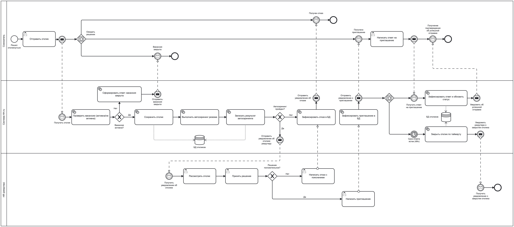

# HH Process


Проект показывает процесс обработки отклика на вакансию. Кандидат отправляет заявку, система проводит первичную проверку, рекрутер принимает решение, а дальнейшие действия идут через BPMN-процессы Camunda.



## Что внутри

- REST API для кандидатов, рекрутеров и администратора.
- Camunda BPM для пользовательских задач, форм и решений DMN.
- WildFly, в который разворачивается приложение.
- PostgreSQL для данных приложения и Camunda.
- Flyway-миграции, JTA/Narayana-транзакции и WebSocket-уведомления.


## Как запустить

Нужны Docker и Docker Compose.

```bash
docker compose up --build
```

После запуска:

- приложение: `http://localhost:8080`
- Camunda: `http://localhost:8081`
- PostgreSQL: `localhost:5432`

Быстрая проверка:

```bash
curl http://localhost:8080/actuator/health
curl http://localhost:8081/engine-rest/engine
```

Остановить проект:

```bash
docker compose down
```

Начать с чистой базы:

```bash
docker compose down -v
docker compose up --build
```
